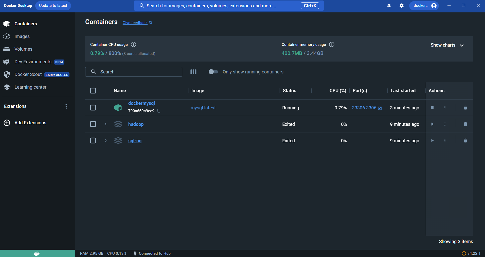
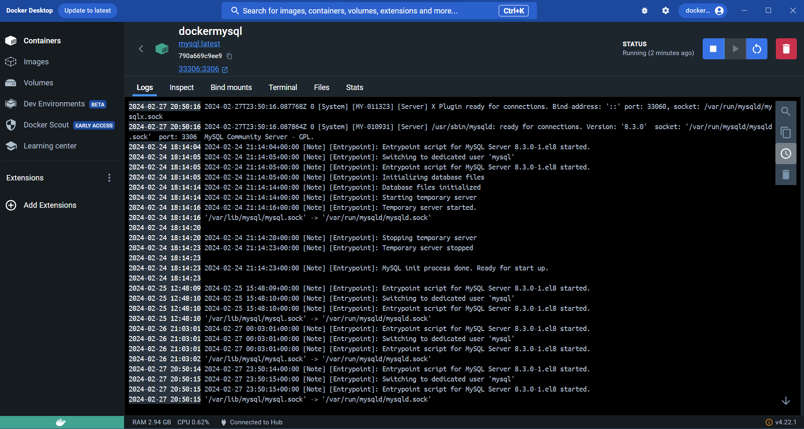
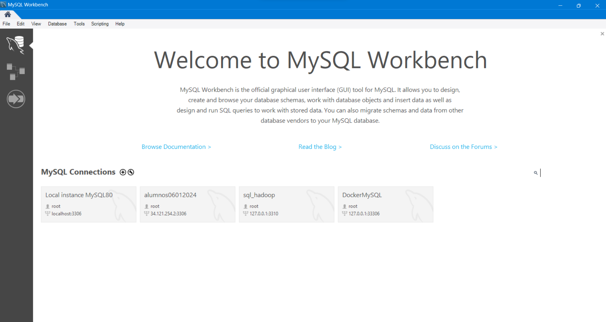
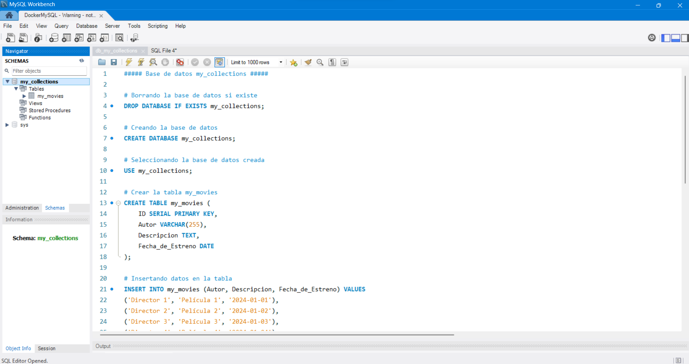
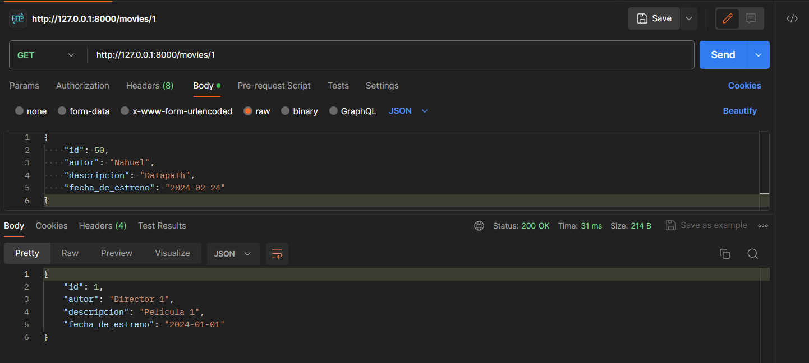
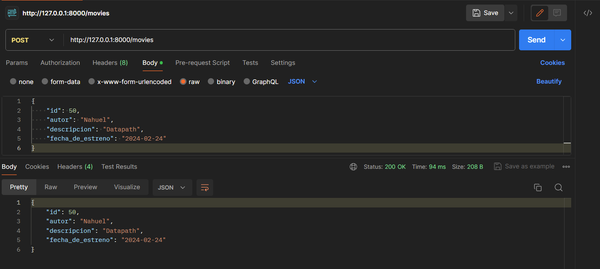
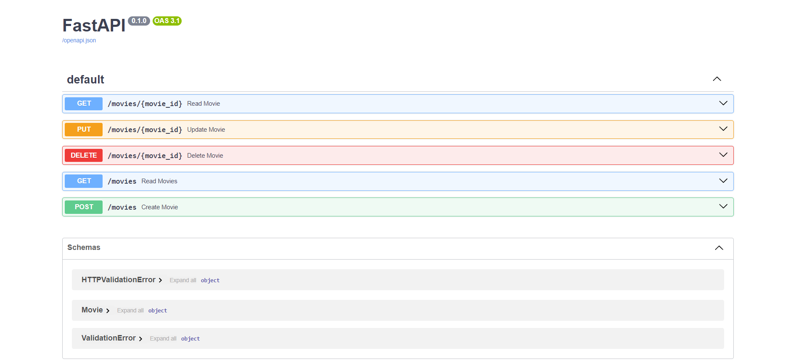

# **`FastAPI & Docker & MySQL`** 
## *CRUD con FastAPI a una base de datos MySQL dockerizada* 
### **Nahuel-DevOne⚡**

### *`Información del proyecto:`*

#### Proyecto final del módulo 6 `"Despliegue Data API's con Python"`
Es un CRUD con FastAPI a una base de datos MySQL Dockerizada. 
Utilicé MySQL Workbench como interfaz gráfica para la creación de la base de datos, Python como lenguaje, FastAPI para crear la API, Uvicorn para levantar el servidor, Postman para corroborar las métodos HTTP, aunque también hice uso del Swagger incorporado de FastAPI, un ambiente virtual y variables de entorno.
Para Docker utilicé Docker Desktop.

#### Para realizar las instalaciones:
Se recomienda generar un ambiente virtual:

1) Para crearlo (ej: "venv"):

- En windows:
python -m venv venv

- En Linux o Mac:
python3 -m venv venv

2) Para activarlo

- En windows, con Powershell:
venv/Scripts/activate

- En windows, con bash:
source venv/Scripts/activate

- En Linux o Mac:
source env/bin/activate

3) Para desactivarlo cuando ya no se use
deactivate

Con el ambiente virtual **activado**, para realizar todas las instalaciones:
- `pip install -r requirements.txt` 

### Capturas de pantalla de parte del trabajo realizado:

**En Docker:**

**En Workbench:**

**En Postman:**

**En FastAPI: `http://127.0.0.1:8000/docs`**

### *`Desarrollado con:`*

- [Visual Studio Code](https://code.visualstudio.com/)
- [Docker](https://www.python.org/)
- [MySQL](https://www.mysql.com/)
- [Python](https://www.python.org/)
- [FastAPI](https://fastapi.tiangolo.com/)

  <!-- Hecho con amor -->
**Built with 💙** ... Nahuel-DevOne⚡
